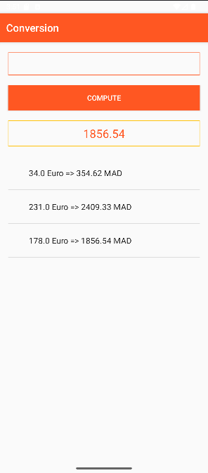

# 💶 Conversion

## Description
This is the first Android application developed for the DevMobile module.  
It allows users to:

- Enter an amount in Euros
- Convert it to Moroccan Dirhams using a fixed rate
- View a history of conversions in a ListView

## Technologies Used
- Java
- Android SDK
- XML Layout (LinearLayout)
- ListView, EditText, TextView, Button

## Screenshot
