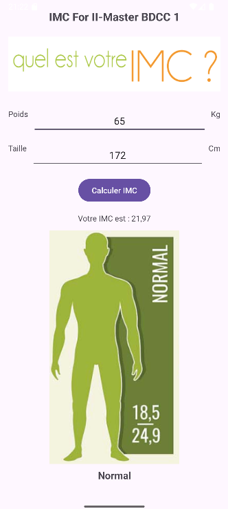
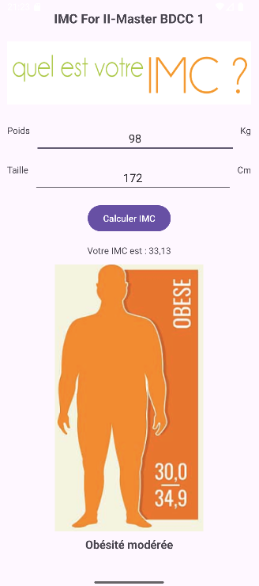

# ⚖️ Calcul IMC

## Description
This application calculates the Body Mass Index (IMC). It allows users to:

- Enter their weight and height
- Display the IMC value
- Show an image and text based on the BMI category:
  - Maigreur
  - Poids normal
  - Surpoids
  - Obésité

## Technologies Used
- Java
- ConstraintLayout
- ImageView, EditText, TextView, Button
- Responsive UI for mobile devices

## Screenshot

