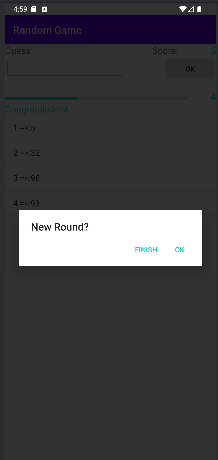
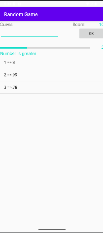
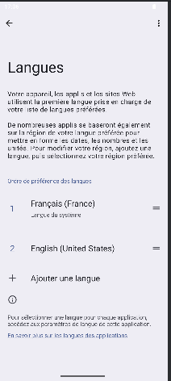

# 🎲 Jeu de Devinette

## Description
A random number guessing game. The app:

- Generates a secret number between 1 and 100
- Guides the user with hints like “Too Small” or “Too Big”
- Tracks the number of attempts using a ProgressBar
- Displays a score and saves attempt history
- Switching language depends on user default language.

Each game increases score if the user wins within the allowed attempts.

## Technologies Used
- Java
- Android SDK
- AlertDialog, ListView, ProgressBar
- Multi-language support: FR, EN, AR

## Screenshot

